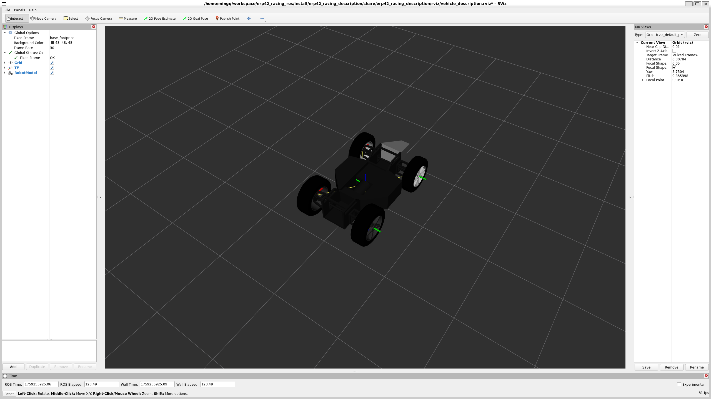

# erp42_racing_description
ERP42 Racing vehicle description package. Uses ERP42 Racing platform-related properties to define ERP42 Racing.
``` bash
$ ros2 launch erp42_racing_dscription vehicle_description.launch.py
```

<div align="center">

  
  <br/>
  <figcaption>ERP42 Racing description in .xacro</figcaption>

</div>

<br/><br/>

<div align="center">

  
  <br/>
  <figcaption>Transforms being broadcast</figcaption>

</div>

<br/><br/>

All settings are macroized in the **.xacro** file, so you can use them as follows:
``` xml
<!-- Include files -->
<xacro:include filename="$(find erp42_racing_description)/urdf/erp42_racing_model.xacro"/>

<!-- ERP42 Racing model description -->
<xacro:erp42_racing_model/>
```